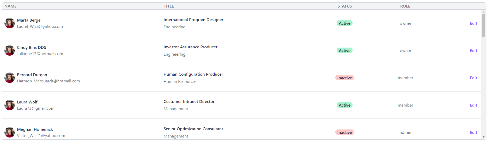

# Scrollable, inline-editable table of company Employees using React JS and Tailwindcss

A simple web application that fetches data of company's employees from a JSON Endpoint and presents them on a scrollable table. In addition, allows inline editing of employee's data.   

## Requirements
+ [Node.js](https://nodejs.org/)
+ [ReactJS](https://reactjs.org/)
+ [Javascript/Typescript](https://www.javascript.com)
+ [Tailwindcss](https://tailwindcss.com/)

##  Getting Started

	Get the project from the repository
	git clone https://github.com/KostasZigo/Employees_table.git
    
    Then you have to install npm packages of the application using:
    npm install
    
    You can start the application by executing the command bellow:
    npm start
   
## Usage

 1. Enter localhost:3000 from your browser to connect to the application.
 2. Your browser page should look like the image bellow: 
	
 3. By clicking the *Edit* button on a certain employee you can change some of his/her information:
 	+ Change his/her Title information by writing on an input field
 	+ Change his/her status from *Active* to *Inactive* and vice versa by clicking on his/her status button
 	+ Change his/her role on the company by choosing an otpion from a dropdown menu
    You can click the *Save* button to save any changes you made on these fields. (see image bellow).

## Contributors

+ [Konstantinos Zigogiannis Mplionas](https://github.com/KostasZigo)

